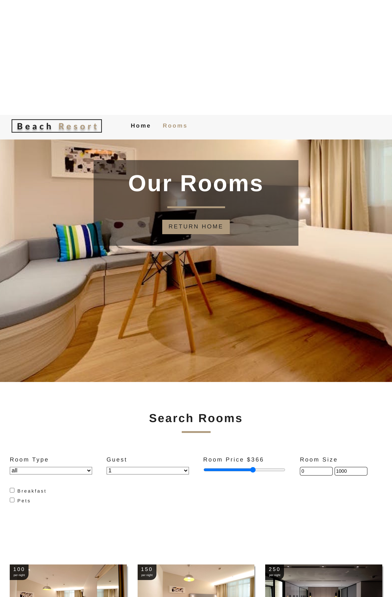

## CAPSTONE PROJECT: HomeFinder

this is a complete react front-end application that helps in making hotel reservation

- The site is responsive and accomodate devices that fall in three breakpoints

## Built With

- HTML5
- CSS3
- Reactjs 16
- Context API
- Styled components

## Author

- Github: [@githubhandle](https://github.com/chirchir12)
- Twitter: [@twitterhandle](https://twitter.com/shadochir)
- Linkedin: [linkedin](https://www.linkedin.com/in/emmanuel-chirchir/)
- Email: [email](chirchir7370@gmail.com)

## Getting started

- Clone the repository with:
  `https://github.com/chirchir12/reservation.git`
- cd to `reservation`

## 🤝 Contributing

Contributions, issues and feature requests are welcome!

Feel free to check the [issues page](issues/).

## Show your support

Give a ⭐️ if you like this project!

## Live preview

You can check how the website looks [here](https://5f020434a90c98a1462b0a48--dazzling-kowalevski-179170.netlify.app/rooms/single-standard)

## 📝 License

This project is [MIT](lic.url) licensed.
